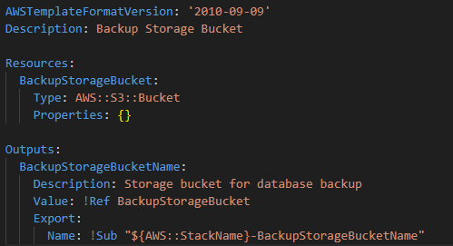

# DIO
Repositório para armazenar conhecimentos obtidos no curso DIO Santander Code Girls 2025 - Módulo Gerenciamento e Governança na AWS.

# AWS Cloud Formation
Serviço que automatiza a criação, atualização e exclusão de recursos da AWS usando arquivos de configuração (templates em YAML ou JSON).
Ou seja, ao invés de criar recursos manualmente no console, um arquivo de configuração é escrito e o CloudFormation cria tudo automaticamente.

**Exemplo de Template para criação de S3 Bucket (arquivo .yaml salvo no repositório):**

**Componentes do Template:**
- AWSTemplateFormatVersion: define o formato da versão do template.
- Description: define a descrição do template, para detalhar mais informações sobre o que está sendo criado.
- Resources: definição dos recursos que serão criados.
- Outputs: utilizado para exibir informações do recurso criado.
- Export: permite compartilhar esse valor com outras stacks.

# Criando um S3 Bucket utilizando CloudFormation

- Busque por "cloud formation" na barra de pesquisa, acesse o serviço e selecione a opção de "Create stack".

- Visto que o objetivo é utilizar o código compartilhado acima como template para fazer a criação do S3, selecionar "Choose an existing template" e "Upload a template file". Em seguida, acesse a opção de selecionar o arquivo e selecione o arquivo YAML criado.

- Na etapa de especificar detalhes da stack, definir o nome a ser utilizado.

- Na etapa de configurar opções é possível adicionar tags, definir permissões especiais de acesso para a CloudFormation com base em roles já existentes, adicionar políticas, configurar notificações aplicar outras configurações. Nesse exemplo, atualizar a política de falhas para que caso aconteça uma falha na criação dos recursos, aconteça um rollback de toda a stack (ou seja, nenhuma ação será realizada).

- A última etapa é para revisão de todas as configurações realizadas. Confirmando que tudo está correto, clicar em "Submit" para que a criação do recurso seja concluído.

- Após alguns segundos, os eventos serão atualizados na lista e os status de CREATE_IN_PROGRESS e CREATE_COMPLETE aparecerão, detalhando que a criação ocorreu e foi finalizada.

- Por fim, ao acessar o S3, é possível encontrar o bucket criado via CloudFormation - comprovando o correto funcionando do recurso.
